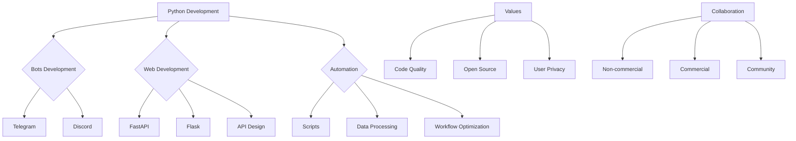

# 👨‍💻 Kisyufka | Python Developer

> "Код — это поэзия, которая работает" / "Code is poetry that works"

---

## 🌐 Quick Links / Быстрые ссылки
[](https://t.me/Kisyufka)
[](https://github.com/kisyufka)
[](https://python.org)

---

## 🚀 About Me / Обо мне

<div align="center">
  
| 🇷🇺 Русская версия | 🇺🇸 English Version |
|-------------------|---------------------|

</div>

### 🇷🇺 Русская версия

Привет! Я **Kisyufka** — Python-разработчик, специализирующийся на создании практичных и эффективных решений для автоматизации и повседневных задач.

**💻 Что я разрабатываю:**
- 🤖 **Telegram боты** — от простых утилит до многофункциональных систем с различными интеграциями
- 🎮 **Discord боты** — с модерацией, игровыми механиками и автоматизацией сообществ
- 🌐 **Веб-приложения и сайты** — преимущественно бэкенд на FastAPI/Flask
- ⚙️ **Скрипты автоматизации** — для оптимизации рутинных задач и обработки данных
- 🔧 **API и микросервисы** — для различных интеграций и сервисов

**🛠 Мой технический стек:**
- **Языки:** Python 3.8+
- **Фреймворки:** FastAPI, Flask, aiogram, pyrogram, discord.py
- **Базы данных:** PostgreSQL, SQLite, Redis
- **Инструменты:** Git, Docker, REST API, HTML/CSS/JS (базово)
- **Библиотеки:** asyncio, SQLAlchemy, pytest, BeautifulSoup, Pandas

**💼 Условия сотрудничества:**
- ✅ **Бесплатно/нематериально**: Открыт к интересным **некоммерческим проектам**, особенно:
  - Социально значимым инициативам
  - Образовательным проектам
  - Творческим и экспериментальным идеям
  - Open-source проектам с активным сообществом
- 💰 **Коммерчески**: Для бизнес-запросов и коммерческих задач работаю на **платной основе**. Готов обсуждать проекты с четкими требованиями и сроками.
- 🤝 **Open Source**: Активно участвую в open-source сообществе. Все мои проекты доступны на GitHub для изучения и использования.

**📬 Контакты для связи:**
- **Telegram:** [@Kisyufka](https://t.me/Kisyufka) — предпочтительный способ связи
- **GitHub Issues:** Для обсуждения моих проектов, багов и предложений
- **GitHub Discussions:** Для более развернутых обсуждений и идей

---

### 🇺🇸 English Version

Hi! I'm **Kisyufka** — a Python developer specializing in creating practical and efficient solutions for automation and everyday tasks.

**💻 What I Develop:**
- 🤖 **Telegram bots** — from simple utilities to multifunctional systems with various integrations
- 🎮 **Discord bots** — with moderation, game mechanics, and community automation
- 🌐 **Web applications and websites** — mainly backend with FastAPI/Flask
- ⚙️ **Automation scripts** — for optimizing routine tasks and data processing
- 🔧 **APIs and microservices** — for various integrations and services

**🛠 My Tech Stack:**
- **Languages:** Python 3.8+
- **Frameworks:** FastAPI, Flask, aiogram, pyrogram, discord.py
- **Databases:** PostgreSQL, SQLite, Redis
- **Tools:** Git, Docker, REST API, HTML/CSS/JS (basic)
- **Libraries:** asyncio, SQLAlchemy, pytest, BeautifulSoup, Pandas

**💼 Collaboration Terms:**
- ✅ **Free/Non-commercial**: Open to interesting **non-commercial projects**, especially:
  - Socially significant initiatives
  - Educational projects
  - Creative and experimental ideas
  - Open-source projects with active communities
- 💰 **Commercial**: For business requests and commercial tasks, I work on a **paid basis**. Ready to discuss projects with clear requirements and deadlines.
- 🤝 **Open Source**: Actively participate in the open-source community. All my projects are available on GitHub for study and use.

**📬 Contact Information:**
- **Telegram:** [@Kisyufka](https://t.me/Kisyufka) — preferred method of communication
- **GitHub Issues:** For discussing my projects, bugs, and suggestions
- **GitHub Discussions:** For more detailed discussions and ideas

---

## 📊 GitHub Statistics

<div align="center">

### Статистика профиля / Profile Stats


### График активности / Activity Graph


</div>

---

## 🏆 Featured Projects / Избранные проекты

<div align="center">

### 🤖 **Python Projects**
*Мои основные проекты на Python / My main Python projects*

[](https://github.com/kisyufka?tab=repositories)

</div>

**🎯 Категории проектов / Project Categories:**
- **Telegram Bots** — автоматизация, утилиты, игры
- **Discord Bots** — модерация, сообщества, развлечения
- **Web Applications** — веб-сервисы и панели управления
- **Automation Tools** — скрипты для повседневных задач
- **Learning Projects** — экспериментальные и учебные проекты

---

## 📈 Development Focus / Фокус разработки



---

## 🎯 Current Goals / Текущие цели

<div align="center">

| 🔭 Работаю над | 🌱 Изучаю | 👯 Ищу |
|----------------|-----------|---------|
| Улучшением существующих проектов | Advanced asyncio patterns | Сотрудничество по open-source |
| Оптимизацией кодовой базы | Микросервисную архитектуру | Интересные некоммерческие проекты |
| Документацией и тестами | Новые Python библиотеки | Технические дискуссии |

</div>

**💬 Готов обсудить / Ready to discuss:**
- Python разработку и лучшие практики
- Создание и оптимизацию ботов
- Веб-разработку на Python
- Автоматизацию повседневных задач

**⚡ Интересный факт / Fun fact:**  
Люблю создавать инструменты, которые решают реальные проблемы и экономят время.

---

## 🏷️ Tags & Technologies / Теги и технологии

### Основные технологии / Core technologies
`Python` `FastAPI` `Flask` `aiogram` `pyrogram` `discord.py` `PostgreSQL` `SQLite` `Docker` `Git` `REST API` `asyncio`

### Интересы / Interests
`automation` `web-development` `open-source` `community-projects` `ethical-tech`

### Изучаю / Learning
`microservices` `advanced-asyncio` `performance-optimization` `testing`

---

## 📜 License & Open Source

<div align="center">


</div>

**Большинство моих проектов используют MIT License** — вы можете свободно использовать, модифицировать и распространять код с указанием авторства.

```
MIT License

Разрешено:
- Использование в личных и коммерческих целях
- Модификация и распространение
- Частное использование

Требуется:
- Указание авторства
- Включение лицензии MIT

Запрещено:
- Ответственность автора за последствия использования
```

---

<div align="center">

## 💻 Quality Code & Open Source


### 🚀 **Качественный код решает задачи**  
### 🚀 **Quality Code Solves Problems**

[](https://github.com/kisyufka)
[](https://github.com/kisyufka)

**Свяжитесь со мной в Telegram для обсуждения проектов!**  
**Contact me on Telegram to discuss projects!**

</div>

---

<details>
<summary>📊 Additional Stats / Дополнительная статистика</summary>


</details>
